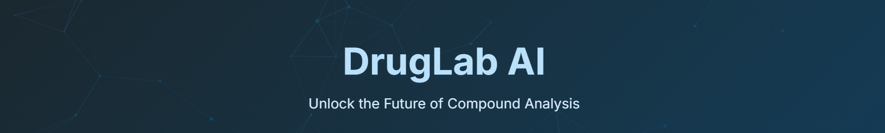
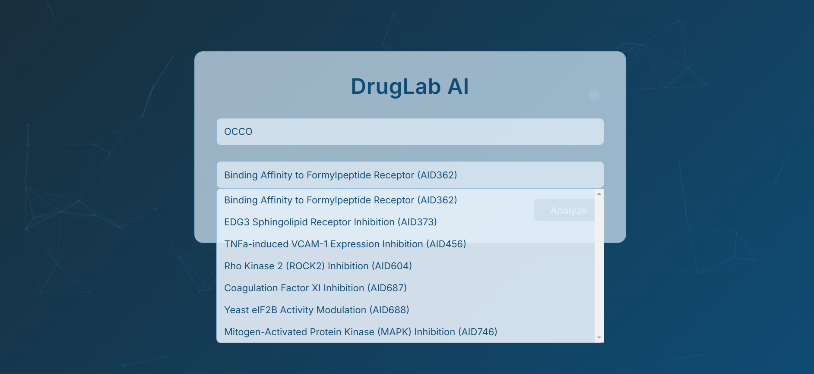
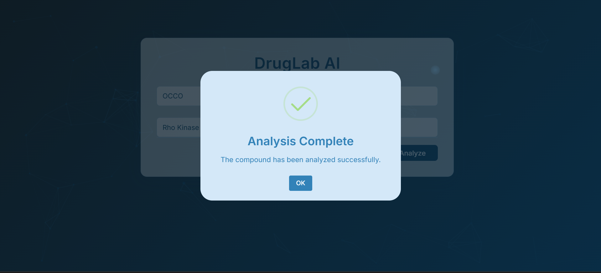
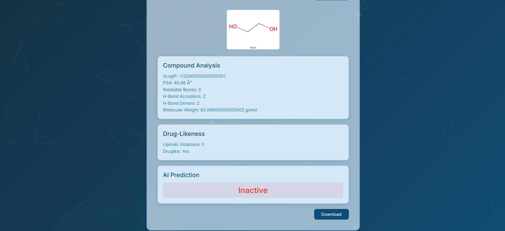
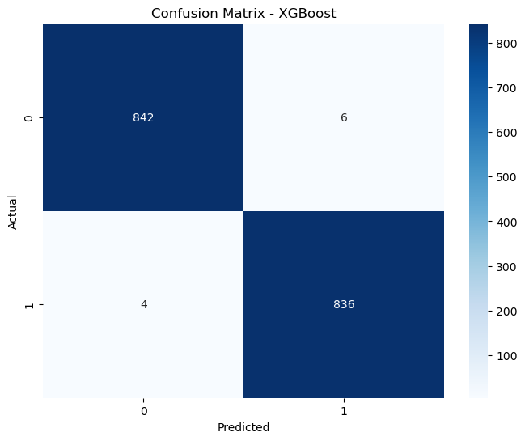
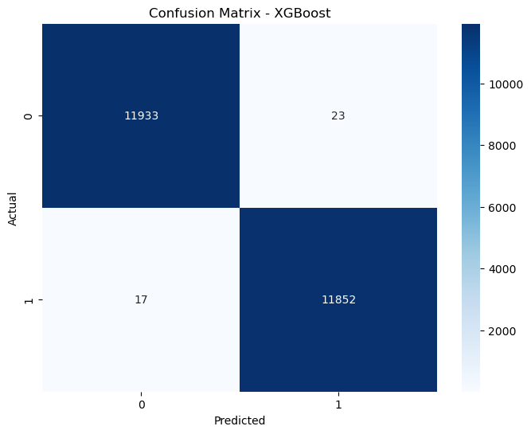
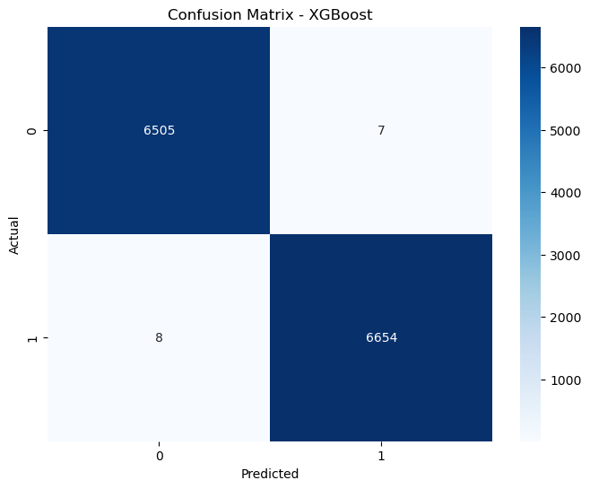

# DrugLab AI: AI-Powered Compound Analysis 🚀

  

---

##  Overview

DrugLab AI is a cutting-edge web application designed to empower pharmaceutical research through artificial intelligence. By leveraging pre-trained machine learning models on the PubChem Bioassay dataset, it predicts compound activity across seven key bioassays, generates 2D molecular visualizations, assesses drug-likeness, and delivers detailed molecular insights—all within an intuitive, interactive interface. Hosted on Render at [https://druglab-ai.onrender.com](https://druglab-ai.onrender.com), DrugLab AI streamlines compound analysis for researchers and scientists.

---

## 🛠️ Tech Stack

- **Frontend**: HTML, CSS, JavaScript
- **Backend**: Flask (Python), Gunicorn
- **AI/ML**: Scikit-learn, XGBoost, SMOTE, GridSearchCV
- **Cheminformatics**: RDKit ( Molecule Visualization)
- **Data**: Pandas, NumPy, Joblib
- **Deployment**: Render ( Cloud Hosting)

---

## 📸 Screenshots

### Details Form 
 

### Processed Pop-up 
 

### Analysis Results 
 

---

## ✨ Features

- **Bioassay Predictions**: Predicts activity for 7 PubChem assays:
  - AID362: Binding Affinity to Formylpeptide Receptor
  - AID373: EDG3 Sphingolipid Receptor Inhibition
  - AID456: TNFa-induced VCAM-1 Expression Inhibition
  - AID604: Rho Kinase 2 (ROCK2) Inhibition
  - AID687: Coagulation Factor XI Inhibition
  - AID688: Yeast eIF2B Activity Modulation
  - AID746: Mitogen-Activated Protein Kinase (MAPK) Inhibition
- **Molecular Visualization**: Displays 2D molecule structures with SMILES labels using RDKit.
- **Drug-Likeness Assessment**: Evaluates Lipinski’s Rule of Five, showing violations and drug-like status.
- **Comprehensive Features**: Extracts 154 molecular properties (e.g., XLogP, PSA, pharmacophore distances).
- **Interactive UI**: Animated dropdowns, popups, and particle effects for an engaging experience.
- **CSV Export**: Downloads full analysis (all features, SMILES, prediction, test, drug-likeness).

---

## ⚙️ Technical Workflow: How It Works

1. **Input**: Users enter a SMILES string (e.g., `CCO`) and select a bioassay (e.g., AID456).
2. **Feature Extraction**: RDKit computes 154 molecular features from the SMILES input.
3. **Prediction**: Pre-trained XGBoost models predict assay activity (Active/Inactive).
4. **Analysis**: Calculates drug-likeness using Lipinski’s rules and generates a 2D molecule image.
5. **Output**:
   - **UI**: Displays key features, drug-likeness, prediction, and visualization.
   - **CSV**: Exports all 156 fields (features, SMILES, prediction, test, drug-likeness) for download.

---

## 🧠 Model Training

DrugLab AI’s models are trained on the **PubChem Bioassay dataset**, optimized for seven assays:
- **Data**: Loads test/train CSV files (e.g., `AID362red_test.csv`, `AID362red_train.csv`).
- **Preprocessing**: SMOTE balances class distribution (e.g., AID362’s high imbalance).
- **Models**: Logistic Regression, Random Forest, AdaBoost, XGBoost, KNN; XGBoost selected for top performance.
- **Tuning**: GridSearchCV (e.g., `n_estimators`: [100, 200, 300]).
- **Metrics**: Accuracy, Precision, Recall, F1 Score.

### Performance Highlights (XGBoost)
| Assay  | Accuracy | Precision | Recall  | F1 Score |
|--------|----------|-----------|---------|----------|
| AID362 | 0.9941   | 0.9929    | 0.9952  | 0.9941   |
| AID373 | 0.9994   | 0.9992    | 0.9997  | 0.9994   |
| AID456 | 0.9985   | 0.9975    | 0.9995  | 0.9985   |
| AID604 | 0.9983   | 0.9981    | 0.9986  | 0.9983   |
| AID687 | 0.9989   | 0.9989    | 0.9988  | 0.9989   |
| AID688 | 0.9931   | 0.9950    | 0.9914  | 0.9932   |
| AID746 | 0.9967   | 0.9961    | 0.9973  | 0.9967   |

### Confusion Matrices
Below are the confusion matrices for XGBoost models across all assays, generated from training notebooks :

- **AID362**:  


- **AID373**:  


- **AID456**:  


- **AID604**:  


- **AID687**:  


- **AID688**:  


- **AID746**:  


---

## 💻 Installation

### Prerequisites
- Python 3.9+
- Git
- (Optional) Conda for local setup

### Local Setup
1. **Clone the Repository**:
   ```bash
   git clone https://github.com/Shrey0808/DrugLab-AI.git
   cd DrugLab-AI
   ```

2. **Create Environment** (Conda recommended):
   ```bash
   conda create -n druglab python=3.9
   conda activate druglab
   ```

3. **Install Dependencies**:
   ```bash
   cd deployment
   conda install -c conda-forge rdkit
   pip install -r requirements.txt
   ```

4. **Run Locally**:
   ```bash
   python app.py
   ```
   Open `http://127.0.0.1:5000`.

---

## 🌐 Usage

1. **Live Demo**:
   - Visit [https://druglab-ai.onrender.com](https://druglab-ai.onrender.com).
   - Enter a SMILES string (e.g., `CCO` for ethanol).
   - Select an assay (e.g., "AID456").
   - Click "Analyze."

2. **View Results**:
   - **Visualization**: 2D molecule with SMILES label.
   - **Compound Analysis**: Key features (XLogP, PSA, etc.).
   - **Drug-Likeness**: Lipinski violations and status.
   - **Prediction**: Active/Inactive result.
   - **Download**: Full analysis as `analysis_result.csv`.

3. **Retrain Models**:
   - Use `notebooks/` (e.g., `AID362.ipynb`) with PubChem data.

---

## 📂 Folder Structure

```
DrugLab-AI/
├── data/
│       └──VirtualScreeningData
├── deployment/
│   ├── static/
│   │   ├── script.js        # Frontend logic
│   │   └── style.css        # Styling
│   ├── templates/
│   │   └── index.html       # UI template
│   ├── models/
│   │   ├── AID362.lb        # Pre-trained XGBoost models
│   │   ├── AID373.lb
│   │   └── ... (7 total)
│   ├── app.py               # Flask backend
│   ├── features.py          # Feature extraction
│   ├── prediction.py        # Prediction logic
│   └── requirements.txt     # Dependencies
├── notebooks/
│   ├── AID362.ipynb         # Model training scripts
│   ├── AID373.ipynb
│   └── ... (7 total)
├── images/
│   ├── landing.png          # Landing page screenshot
│   ├── results.png          # Results page screenshot
│   └── ... (12 total)
└── README.md
```

---

## 🚀 Deployment on Render

DrugLab AI is live on Render:
- **URL**: [https://druglab-ai.onrender.com](https://druglab-ai.onrender.com)
- **Setup**:
  - Root Directory: `deployment/`
  - Runtime: Python 3
  - Build Command: `pip install -r requirements.txt`
  - Start Command: `gunicorn app:app`

---

## 🔮 Future Scope

- **Toxicity Prediction**: Integrate models for safety screening (e.g., Tox21).
- **Batch Processing**: Analyze multiple SMILES inputs simultaneously.
- **Explainability**: Add SHAP for feature importance insights.
- **Cloud Enhancements**: Scale with AWS or GCP for broader access.
- **Mobile App**: Extend to a mobile-friendly interface.

---

## Contributors 👨‍💻
- Shreyansh Sahay [(Shrey0808)](https://github.com/Shrey0808)
- Harsh Kumar [(hrsh-kmr)](https:://github.com/hrsh-kmr)

---

### GitHub Repository 🔗
👉 **[DrugLab-AI](https://github.com/Shrey0808/DrugLab-AI)** 

---